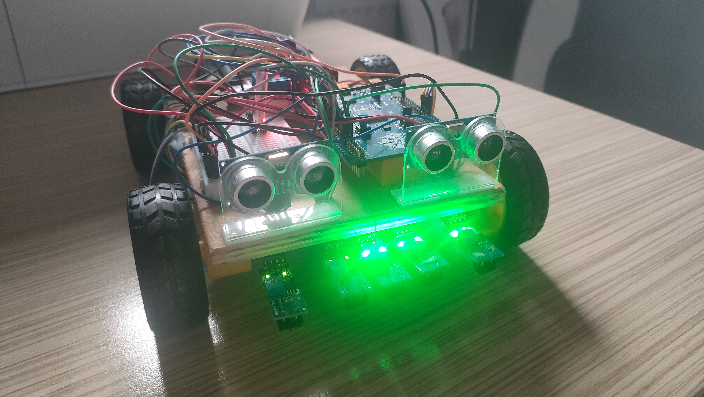
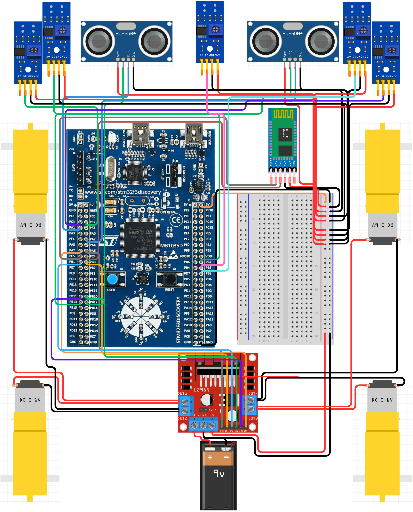
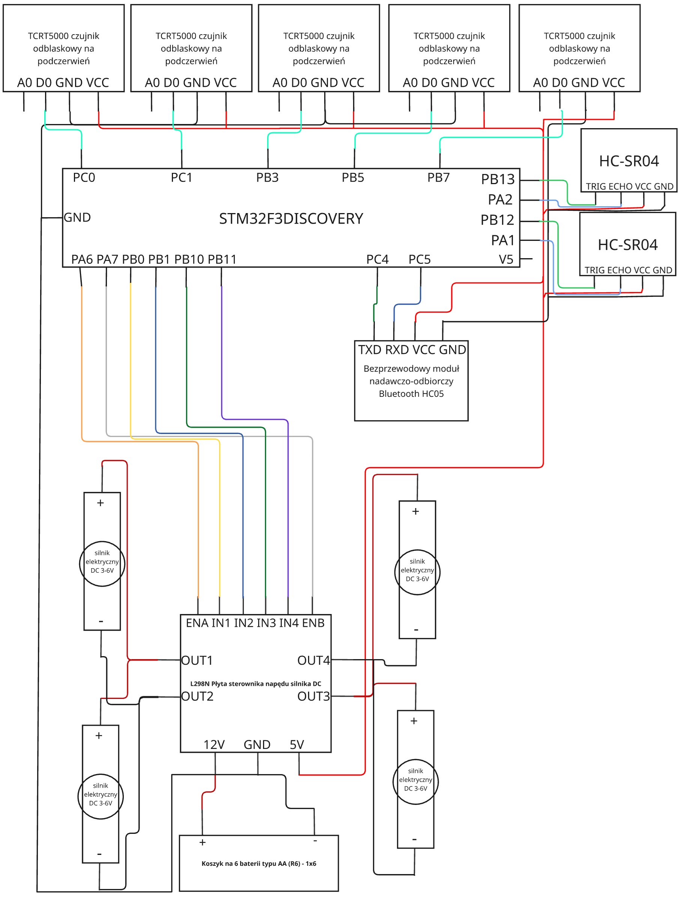

# 🚗 Autonomiczny Pojazd z STM32

Projekt semestralny z przedmiotu **Systemy Wbudowane i Mikrokontrolery**  
Autor: Kacper Adam Woszczyło  
Numer indeksu: 21324  
Data rozpoczęcia: 28.04.2025   
Repozytorium zawiera kod, dokumentację oraz materiały projektowe.

---

---

## 📌 Opis projektu

Projekt zakłada stworzenie zaawansowanego modelu pojazdu autonomicznego opartego na mikrokontrolerze STM32F3Discovery, który może funkcjonować w dwóch trybach działania: półautomatycznym oraz w pełni autonomicznym. W trybie półautomatycznym pojazd realizuje komendy wydawane przez użytkownika za pośrednictwem interfejsu UART, który umożliwia komunikację np. za pomocą modułu Bluetooth HC-05. W trybie automatycznym pojazd samodzielnie analizuje otoczenie przy użyciu zestawu sensorów ultradźwiękowych (HC-SR04) oraz optycznych (czujniki IR TCRT5000), co pozwala mu wykrywać i zatrzymać się jeżeli wykryje daną przeszkode oraz precyzyjnie podążać za namalowaną na podłożu linią trasy. Sterowanie napędem jest realizowane za pomocą sygnałów PWM generowanych przez wbudowane timery mikrokontrolera, umożliwiających precyzyjną regulację prędkości jazdy oraz płynność manewrów. System sterowania opiera się na efektywnej obsłudze przerwań oraz ewentualnie na systemie operacyjnym czasu rzeczywistego (RTOS), zapewniającym dokładne zarządzanie zadaniami. Użytkownik poprzez komendy UART może dynamicznie zmieniać parametry jazdy, odczytywać aktualny stan czujników oraz przełączać tryby pracy pojazdu, co umożliwia pełną kontrolę oraz analizę danych w czasie rzeczywistym.

---

## 🛠️ Zastosowane technologie i narzędzia

- **Mikrokontroler:** STM32F3DISCOVERY
- **IDE:** STM32CubeIDE
- **Programowanie:** C (HAL / LL)
- **Sensory:**
  - 2x HC-SR04 (ultradźwiękowy)
  - 5x Sensory optyczne TCRT5000 (IR)
- **Zasilanie:** Koszyk na 6 baterii typu AA (R6) - 1x6
- **Sterownik silników:** L298N
- **Komunikacja:** UART przez Bluetooth HC-05
- **Sterowanie:** Aplikacja mobilna [`Serial Bluetooth Terminal`](https://play.google.com/store/apps/details?id=de.kai_morich.serial_bluetooth_terminal&hl=pl) (Android)

---

## 🛠️ Schemat podłączeń

---

## 🔩 Opis połączeń

---

## ⚙️ Funkcjonalności

- ✅ **Napęd robota sterowany przez PWM** – płynna kontrola prędkości silników
- ✅ **Jazda do przodu, do tyłu, skręt w lewo i prawo** – niezależne sterowanie silnikami przez mostek
- ✅ **Regulacja prędkości jazdy** – możliwość zwiększania i zmniejszania prędkości
- ✅ **Jazda po linii z detekcją przeszkód** – reagowanie przez sensorów IR i czujniki ultradźwiękowe
- ✅ **Unikanie kolizji** – zatrzymywanie robota w przypadku wykrycia przeszkody
- ✅ **Zdalne sterowanie przez Bluetooth (HC-05)** z poziomu np. telefonu
- ✅ **Sterowanie tekstowe przez UART** – wysyłanie komend do robota
- ✅ **Wyświetlanie odległości** – robot przesyła informacje o odległości z lewej i prawej strony
- ✅ **Tryb automatyczny (jazda po linii)** – robot samodzielnie podąża za trasą i omija przeszkody
- ✅ **Autonomiczne zasilanie bateryjne** – pełna autonomia

---

## 📁 Struktura repozytorium

STM32F3Discovery-Autonomiczny-Pojazd/
├── Dokumentacja/
│   ├── Harmonogram.pdf
│   ├── Milstone1_21324.pdf
│   ├── Milstone2_21324.pdf
│   ├── Milstone3_21324.pdf
│   ├── STM32F3Discovery.pdf
│   ├── Schemat4.1.pdf
│   └── Schemat4.2.pdf
├── Kod/ ~ # Kod źródłowy projektu
├── Media/
│   ├── Zdjęcia/
│   └── Filmy/   
├── LICENSE.md
└── README.md

---

## 📡 Komendy UART

| Komenda | Opis                                      |
|--------:|-------------------------------------------|
| `G`     | Jazda do przodu                           |
| `T`     | Jazda do tyłu                             |
| `L`     | Skręt w lewo                              |
| `P`     | Skręt w prawo                             |
| `S`     | Zatrzymanie robota                        |
| `M`     | Zwiększenie prędkości                     |
| `N`     | Zmniejszenie prędkości                    |
| `A`     | Włączenie trybu automatycznego (jazda po linii) |
| `a`     | Wyłączenie trybu automatycznego i zatrzymanie |
| `O`     | Wyświetlenie odległości z czujników       |

---

## 🧪 Scenariusze testowe

- ✔ Detekcja przeszkody z przodu (sensor HC-SR04)
- ✔ Reakcja na białą/czarną linię (czujniki IR)
- ✔ Komunikacja przez Bluetooth z aplikacją mobilną
- ✔ Test zasilania bateryjnego (mobilność bez kabli)
- ✔ Sterowanie ruchem w czasie rzeczywistym (UART)
- ✔ Zmiana prędkości robota komendami
- ✔ Przełączanie między trybem ręcznym a automatycznym
- ✔ Poprawne zatrzymanie robota na komendę
- ✔ Odczyt i transmisja odległości przez UART
- ✔ Reakcja na przeszkody podczas jazdy po linii

---

## 📸 Demo i zdjęcia

- [`Zdjęcia pojazdu`](./Media/Zdjęcia)
- [`Nagranie testów`](./Media/Filmy)

---

## 📄 Dokumentacja

Pełna dokumentacja projektu znajduje się w folderze [`Dokumentacja`](./Dokumentacja/), w tym:
- Raporty z postępów prac nad pojazdem
- Schematy układów
- Lista komponentów

---

## 📅 Harmonogram pracy

- Milestone 1: 19.05.2025
- Milestone 2: 27.05.2025
- Milestone 3: 03.06.2025
- Prezentacja projektu: 10.06.2025

---

## 🧠 Wnioski

_(Tutaj uzupełnij po zakończeniu projektu)_

---

## 📬 Kontakt

W razie pytań:
- Email:   21324@student.ans-elblag.pl
- GitHub:  https://github.com/kacprow21324

---

**Licencja:** [`MIT`](./LICENSE.md)   
